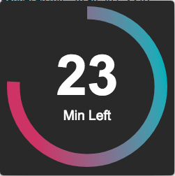

# Timely

A simple and timely reminder to take a quick break and move around before getting back to work.

Built on top of [Electron React Boilerplate](https://github.com/chentsulin/electron-react-boilerplate).



## Install

* **Note: requires a node version >= 7 and an npm version >= 4.**
* **If you have installation or compilation issues with this project, please see [our debugging guide](https://github.com/chentsulin/electron-react-boilerplate/issues/400)**

First, clone the repo via git:

```bash
git clone https://github.com/JoeDahle/Timely.git your-project-name
```

And then install dependencies with yarn.

```bash
$ cd your-project-name
$ yarn || npm i
```

## Local Developemt

```bash
$ yarn run dev
```

Alternatively, you can run the renderer and main processes separately. This way, you can restart one process without waiting for the other. Run these two commands **simultaneously** in different console tabs:

```bash
$ npm run start-renderer-dev
$ npm run start-main-dev
```

## Packaging

To package apps for the local platform:

```bash
$ npm run package
```

To package apps for all platforms:

First, refer to [Multi Platform Build](https://www.electron.build/multi-platform-build) for dependencies.

Then,

```bash
$ npm run package-all
```

To package apps with options:

```bash
$ npm run package -- --[option]
```

To run End-to-End Test

```bash
$ npm run build
$ npm run test-e2e
```
